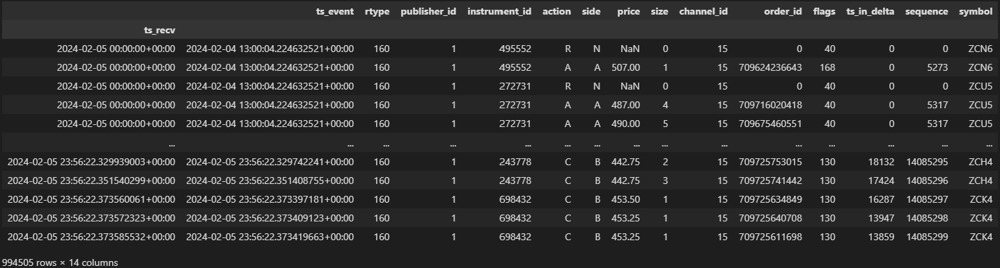

#### The goal of this project is to use the Databento API to research corn futures.

## STEP 1: Get data
Part of this step is learning the best way to store this data, what type of data I want, and how to collect it using the API.

The chosen schema is level 3 data, specifically market by order (MBO), as it provides data on every order book event across every price level (the highest level of granularity). While this data is SUPER overkill for the first few projects I will complete, it can be simplified for my early models and also allows me to do more complex models later on with the same dataset. In other words, this extensive data contains the simpler data within it, but does not restrict me when I want to go deeper later on.

Costs for this: $63.59 USD for [2024-02-04 -> 2026-02-06] @ MBO ($1.80/GB) = 37.9GB

Here is what the data looks like (using the 5th Feb 2024 daily file):
Input:
```python
import databento as db
corn_dbn_file = db.DBNStore.from_file("data/raw/glbx-mdp3-20240205.mbo.dbn")  # from repo root
corn_book_df = corn_dbn_file.to_df()
corn_book_df
```
Output:


Context for the image:

**ACTION**: A = add, C = cancel, M = modify, R = clear, T = trade, F = fill, N = none.  
**SIDE**: A = ask (sell order), B = bid (buy order), N = none

The issue now is that all the code examples and tutorials in the Databento docs use the API and some variation of `client.timeseries.get_range(...)`, while I’m working with downloaded files (629 compressed daily files, each containing a single `.dbn` file). I need to find a way to write a program that can use this data in the same way as the Databento API examples.

Since the data is ~40GB and my laptop only has 16GB of memory, I have to be careful about memory usage (especially once I start running lots of models and operations on it).

To decompress the 629 files, I ran this single-purpose script that places the decompressed files into a new folder, and then I manually deleted the old folder:
```python
import zstandard as zstd
from pathlib import Path

raw = Path("data/raw")
out = Path("data/zipped_raw")
out.mkdir(exist_ok=True)

for zst_file in raw.glob("*.zst"):
    print(f"Unzipping {zst_file.name}...")
    with open(zst_file, 'rb') as f:
        dctx = zstd.ZstdDecompressor()
        with open(out / zst_file.stem, 'wb') as out_f:
            dctx.copy_stream(f, out_f)

```
# What are corn futures?
Before I begin, it’s probably best to describe what a corn futures contract is. A futures contract is an agreement between a buyer and seller (of corn) to buy/sell corn in a set quantity at a future date, at a price agreed today. While these instruments are intended for farmers and businesses who use corn to hedge the risk of corn prices falling/rising, they can also be used for speculative purposes (to predict price action and profit from it).

Price action is relatively simple for corn, compared to some other assets. It can be broken down into supply (higher supply = lower price) and demand (higher demand = higher price).

Supply is influenced by production (weather, agri-tech), transport, storage, and the economics of alternative crops (which influences a farmer’s decision to plant corn vs something like soybeans).

Demand is influenced by demand for corn byproducts: sweetener (HFCS), cornstarch, biofuel (ethanol), and livestock feed. This demand can sometimes be inferred from price movements in companies that rely heavily on these byproducts. For example, an increase in Pepsi’s market cap (driven by increased demand for Pepsi drinks) could imply higher sweetener demand, which could imply higher corn demand.

When it comes to actually trading futures, a trader must understand leverage. For corn futures, a single contract represents 5,000 bushels, so if corn is priced at $4.50 per bushel, the trader has a notional exposure of $22,500 per contract. Additionally, the margin account (where intraday profits/losses are credited/debited) has a minimum level. When first taking the futures position, the trader must meet the initial margin (typically ~4.8% of notional exposure). Once the contract is active, the trader only needs to stay above the maintenance margin (typically ~4.3%); additional funds must be deposited if the account falls below that value. Margin requirements also change with volatility: if volatility increases, the exchange will require traders to hold more funds in their margin account.


# Visualising Data
For the first step (visualising the data), I will use the front-month futures contract as the representation of the price of corn at a given time. This is because corn futures are often in contango, meaning later-expiring contracts are priced higher to account for storage and financing costs embedded in deferred contracts. The front-month contract minimizes this effect and more closely represents what someone would buy/sell corn for at a given time.

To build a continuous front-month trades dataset for analysis, I run:
```bash
python scripts/process_all_data.py --data-dir data/raw --output data/processed/front_month_trades.parquet
```

## STEP 2: Display
Display the data as a time-series plot using matplotlib.

## STEP 3: Display 2 EMA lines on a plot of price
This will require researching how to calculate EMA, and how to display it.

## STEP 4: Forward Curve
Learn what the forward curve is, and attempt to calculate and display it using the data at hand.
