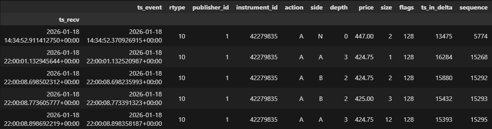
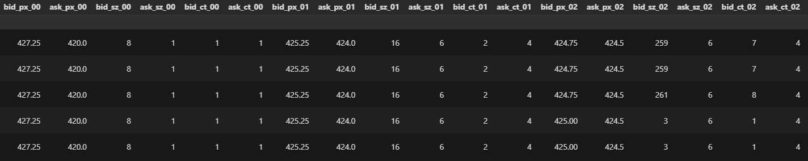
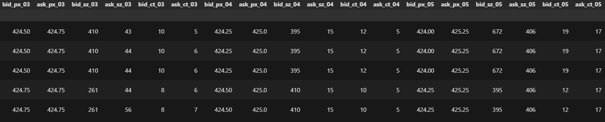
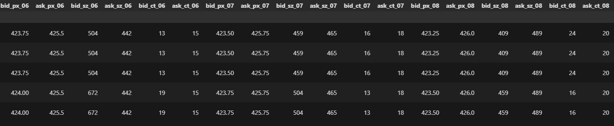
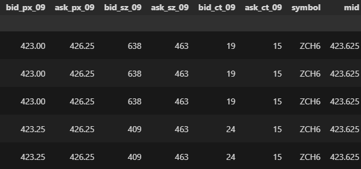
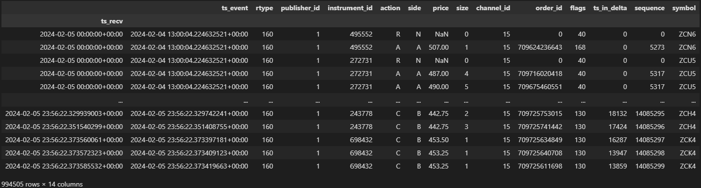

#### The goal of this project is to use the Databento API to research corn futures.

## STEP 1: Get data
Part of this step is learning the best way to store this data, what type of data I want, and how to collect it using the API.

### MBO data (order-level)
I initially purchased MBO (market by order) data — the most granular schema Databento offers. Every individual order event (add, cancel, modify, trade) across every price level for every corn contract.

Cost: $63.59 USD for [2024-02-04 -> 2026-02-06] @ MBO ($1.80/GB) = 37.9GB

The MBO data is stored in `data/raw/mbo/` and was processed into `data/processed/MBO_20240205-20260205.parquet` (front-month trades only — price, size, side). This parquet works fine for basic price analysis, OHLCV, returns, and volatility work.

### Why I switched to MBP-10

The problem: MBO data doesn't include bid/ask book snapshots. To get bid/ask spread data from MBO, you'd need to simulate the full limit order book by replaying every add/cancel/modify event — that's essentially building an order book reconstruction engine, which is an entire project on its own (and one I'm keen to do in the future).

For this project, I need bid/ask data for microstructure analysis, spread checks, and order book context. So instead of spending days building a book simulator, I purchased MBP-10 data directly — it gives me 10 levels of bid/ask depth at every book update, pre-computed by Databento.

MBP-10 data is stored in `data/raw/MPB10_20250216-20260216/` and gets processed into `data/processed/front_month_MBP10.parquet` (front-month trades + 5 levels of bid/ask).

Contrary to what you might initially think, MBP-10 data is actually much larger (in terms of GB) even though it holds less information. This is because after every action in the markets (e.g add order, cancel order, etc) a new row prints out the entire orderbook. While for MBO data, when a new action occurs, the of data only describes features for that specific action, not for the entire orderbook. Note that when I say 'the entire orderbook' I am referring to the 10 levels of bid/ask that MBP-10 data provides; saying 'the entire orderbook' just flows better and gets the idea across nicely.

### Looking at the Data
For this we will look at the 18th of Jan 2026 Daily Data. Here is a display of the top 5 rows, and 73 columns (shown across 5 different images.)







Context for the image:

**ACTION**: A = add, C = cancel, M = modify, R = clear, T = trade, F = fill, N = none.  
**SIDE**: A = ask (sell order), B = bid (buy order), N = none

And it is also important to distinguish what the difference with size and count is (e.g. ask_sz_00 vs ask_ct_00). Size is the total quantity of contracts at that price level, while count is how many different orders make up that quantity.

### Data pipeline

The processing script (`scripts/process_all_data.py`) works with any Databento schema:
- feed it MBO files → gets trade columns only (price, size, side)
- feed it MBP-10 files → gets trade columns + bid/ask book levels

It auto-detects the year range from filenames, generates the CME expiration schedule, filters to front-month trades, and saves to parquet. It's incremental — re-running after adding new .dbn files only processes the new ones.

```bash
# process MBP-10 data (primary dataset for all modules)
python scripts/process_all_data.py --data-dir data/raw/mbp10 --output data/processed/front_month_MBP10.parquet
```

Here is what the raw MBO data looks like (using the 5th Feb 2024 daily file):
Input:
```python
import databento as db
corn_dbn_file = db.DBNStore.from_file("data/raw/mbo/glbx-mdp3-20240205.mbo.dbn")  # from repo root
corn_book_df = corn_dbn_file.to_df()
corn_book_df
```
Output:


Context for the image:

**ACTION**: A = add, C = cancel, M = modify, R = clear, T = trade, F = fill, N = none.  
**SIDE**: A = ask (sell order), B = bid (buy order), N = none

Since the data is ~40GB and my laptop only has 16GB of memory, I have to be careful about memory usage (especially once I start running lots of models and operations on it).

To decompress the 629 MBO files, I ran this single-purpose script that places the decompressed files into a new folder, and then I manually deleted the old folder:
```python
import zstandard as zstd
from pathlib import Path

raw = Path("data/raw")
out = Path("data/zipped_raw")
out.mkdir(exist_ok=True)

for zst_file in raw.glob("*.zst"):
    print(f"Unzipping {zst_file.name}...")
    with open(zst_file, 'rb') as f:
        dctx = zstd.ZstdDecompressor()
        with open(out / zst_file.stem, 'wb') as out_f:
            dctx.copy_stream(f, out_f)

```
# What are corn futures?
Before I begin, it's probably best to describe what a corn futures contract is. A futures contract is an agreement between a buyer and seller (of corn) to buy/sell corn in a set quantity at a future date, at a price agreed today. While these instruments are intended for farmers and businesses who use corn to hedge the risk of corn prices falling/rising, they can also be used for speculative purposes (to predict price action and profit from it).

Price action is relatively simple for corn, compared to some other assets. It can be broken down into supply (higher supply = lower price) and demand (higher demand = higher price).

Supply is influenced by production (weather, agri-tech), transport, storage, and the economics of alternative crops (which influences a farmer's decision to plant corn vs something like soybeans).

Demand is influenced by demand for corn byproducts: sweetener (HFCS), cornstarch, biofuel (ethanol), and livestock feed. This demand can sometimes be inferred from price movements in companies that rely heavily on these byproducts. For example, an increase in Pepsi's market cap (driven by increased demand for Pepsi drinks) could imply higher sweetener demand, which could imply higher corn demand.

When it comes to actually trading futures, a trader must understand leverage. For corn futures, a single contract represents 5,000 bushels, so if corn is priced at $4.50 per bushel, the trader has a notional exposure of $22,500 per contract. Additionally, the margin account (where intraday profits/losses are credited/debited) has a minimum level. When first taking the futures position, the trader must meet the initial margin (typically ~4.8% of notional exposure). Once the contract is active, the trader only needs to stay above the maintenance margin (typically ~4.3%); additional funds must be deposited if the account falls below that value. Margin requirements also change with volatility: if volatility increases, the exchange will require traders to hold more funds in their margin account.


# Visualising Data
For the first step (visualising the data), I will use the front-month futures contract as the representation of the price of corn at a given time. This is because corn futures are often in contango, meaning later-expiring contracts are priced higher to account for storage and financing costs embedded in deferred contracts. The front-month contract minimizes this effect and more closely represents what someone would buy/sell corn for at a given time.

## STEP 2: Display
Display the data as a time-series plot using matplotlib.

## STEP 3: Display 2 EMA lines on a plot of price
This will require researching how to calculate EMA, and how to display it.

## STEP 4: Forward Curve
Learn what the forward curve is, and attempt to calculate and display it using the data at hand.
